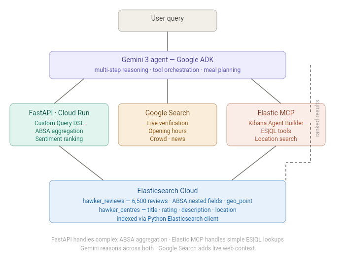

# HawkerHero
Hawker centres are the heart of Singapore's food culture — open-air complexes where independent stall owners serve affordable, iconic local dishes that have been perfected over generations \
HawkerHero is a hawker food discovery engine that lets users search by dish, with over  **6000** most relevant scraped reviews for over **60** hawkers as its data. \
Instead of relying on static stall listings, HawkerHero **aggregates and analyzes** thousands of reviews, extracting dish-level sentiment and popularity so users can find the best laksa, char kway teow, or chicken rice anywhere in Singapore.


## Architecture 
### Agent Layer
- **Google ADK** (Agent Development Kit) with **Gemini 3 Flash** 
- Multi-step reasoning across 4 tools — search, location, web, meal planning
- Agentic behaviours: retry logic, conflict detection, cross-referencing, geographic stop planning

### Tools
- **FastAPI deployed on Cloud Run** — custom Elasticsearch Query DSL with ABSA nested aggregation, review data such as review text for sentiment-ranked results
- **Elastic MCP** via Kibana Agent Builder — ES|QL tools for location search and hawker centre metadata
- **Google Search** — live stall verification, opening hours, crowd conditions

### Data Layer
- **Elasticsearch Cloud** — 6,500 hawker reviews indexed with ABSA nested fields and `geo_point` coordinates
- `hawker_reviews` index — aspect-based sentiment scores per dish per stall
- `hawker_centres` index — metadata, ratings, descriptions, coordinates

### Infrastructure
- FastAPI backend deployed on **Google Cloud Run**
- ADK agent deployed on **Google Cloud Run** with dev UI (`/dev-ui/`)
- Data indexed via Python Elasticsearch client

  
Elastic MCP exposes three ES|QL tools to the agent:
- `get_hawker_info` — fetches centre details, rating, and coordinates by name
- `get_top_rated` — returns the 5 highest rated hawker centres
- `nearest_hawkers` — finds centres within a radius using `ST_DISTANCE` geo queries


               
## Tech Stack

| Component | Technology |
|---|---|
| Agent framework | Google ADK |
| LLM | Gemini 3 Flash (Vertex AI) |
| Search API | FastAPI — custom ABSA Query DSL aggregation |
| Sentiment analysis | PyABSA — aspect-based sentiment on 6,500 reviews |
| Vector/search engine | Elasticsearch Cloud |
| Agent tools (MCP) | Elastic MCP via Kibana Agent Builder |
| Location search | ES\|QL `ST_DISTANCE` geo queries |
| Web search | Google Search (ADK built-in) |
| Deployment | Google Cloud Run (FastAPI + ADK agent) |
 
## Data preparation
   + About 100 most relevant reviews of each 60+ Hawker centre's information is scraped with **Apify Google Maps Scraper** , a JSON file is output, returning over 6000+ review's information such as rating, review text etc.
   + The review texts, together with whether a term matches "recommended dishes" in "reviewContext" will later be further analysed and be used for ranking.
   ``` Sample JSON Object
     {
    "title": "Amoy Street Food Centre",
    "reviewerId": "102379501397919138214",
    "reviewerUrl": "https://www.google.com/maps/contrib/102379501397919138214?hl=en",
    "name": "Karen Heng",
    "reviewerNumberOfReviews": 19,
    "isLocalGuide": true,
    "reviewerPhotoUrl": "https://lh3.googleusercontent.com/a-/ALV-UjXhqlV6v8C0A3PU5i1fnAaJ_JZPzgFBEDFrxQoBannBRkBuzYZ-2w=s1920-c-rp-mo-ba3-br100",
    "text": "A must visit fish soup stall, the lady boss is very generous with her servings, and will even ask you if you want extra pieces of fish! A bowl of mixed fish with tons of vegetables!",
    "textTranslated": null,
    "publishAt": "a year ago",
    "publishedAtDate": "2024-09-24T10:56:54.090Z",
    "likesCount": 0,
    "reviewId": "ChZDSUhNMG9nS0VJQ0FnSUNuNG9ldFZ3EAE",
    "reviewUrl": "https://www.google.com/maps/reviews/data=!4m8!14m7!1m6!2m5!1sChZDSUhNMG9nS0VJQ0FnSUNuNG9ldFZ3EAE!2m1!1s0x0:0xc4c74da290ec162f!3m1!1s2@1:CIHM0ogKEICAgICn4oetVw%7CCgsI9rXKtwYQyKCTKw%7C?hl=en",
    "reviewOrigin": "Google",
    "stars": 4,
    "rating": null,
    "responseFromOwnerDate": null,
    "responseFromOwnerText": null,
    "reviewImageUrls": [
      "https://lh3.googleusercontent.com/geougc-cs/AMBA38tD6j4Ys6s6pYg4bRu5RGo5nPKDdrm0gPtML5OFugbKaWdq-Hi1k-wFSSOD1PmX9xujltX4OImZ-6T_z2JPI7u1Tlj9IFfAZfPrrISRe-zpnz4q5jy7oGZqSr7giVDwKj_H2OCD",
      "https://lh3.googleusercontent.com/geougc-cs/AMBA38tO26trDQM41zFFzclL4Wp-X02u_bc0ymLClMt4IQUuL7XQz54eM6ZnZwLkySL7p8pmohJlKRCWCQaab0HaH7KKqCyxo2pNrhlcxi6HjO-nDEL8IYXJnt2zzVFpinMGF9RpcLef",
      "https://lh3.googleusercontent.com/geougc-cs/AMBA38s6mZ26aAYEs5HyRkpf3Gu9torEy7eOk3YUjPS8YCbqDSdbOCL-yXUlxGICLRtQdjBqY7rQ6mJso2nWzX0JSBPA5QCpW-gmOR2MklsEEKCVTbozqGgdqsCMI0Sx1sLcIpQESZYCLA"
    ],
    "reviewContext": {
      "Service": "Dine in",
      "Meal type": "Lunch",
      "Price per person": "$1–10",
      "Recommended dishes": "Fish Soup, Soup, Fish"
    },
    "reviewDetailedRating": {
      "Food": 4,
      "Service": 4,
      "Atmosphere": 4
    },
    "visitedIn": null,
    "originalLanguage": "en",
    "translatedLanguage": null
  }

   ```
  + Used an Aspect Based Sentiment Model to run on review texts, this extracts the "aspect","sentiment","confidence","probability" of the review text and then added to JSON object. This later contributes to matching ,scoring and ranking of dish/terms 
    ```Sample return
     "absa": [
      {
        "aspect": "fruit cake",
        "sentiment": "Positive",
        "confidence": 0.9995,
        "probs": [
          0.0002367699780734256,
          0.0002480022085364908,
          0.9995152950286865
        ]
      },
      {
        "aspect": "flavour",
        "sentiment": "Positive",
        "confidence": 0.9992,
        "probs": [
          0.00036933875526301563,
          0.0003876440750900656,
          0.9992430210113525
        ]
      }
    ]
    ```
 + JSON data indexxed to ElasticSearch, use strict ElasticSearch mapping rules to ensure data consistency & integrity. Similar to data types for a programming language.
  ```
  mapping = {
    "settings": {
        "analysis": {
            "analyzer": {
                "folding_analyzer": {
                    "tokenizer": "standard",
                    "filter": ["lowercase", "asciifolding"]
                }
            },
            "normalizer": {
                "lowercase_normalizer": {
                    "type": "custom",
                    "filter": ["lowercase","asciifolding"]
                }
            }
        }
    },
    "mappings":{
        "properties":{
            "hawker_name":{
                "type": "text",
                "analyzer": "folding_analyzer",
                "fields": {
                    "keyword": {"type": "keyword",
                                "normalizer":"lowercase_normalizer"
                            }
                        }
            },
            "hawker_id": {
            "type": "keyword"
            },
            "location": {
                "type": "geo_point"
            },
            "review_text": {
                "type": "text",
                "analyzer": "english"
            },
            "review_rating": {"type": "integer"},
            "review_author": {"type": "keyword"},
            "review_date": {"type": "date"},

            "food_rating": {"type": "integer"},
            "service_rating": {"type": "integer"},
            "atmosphere_rating": {"type": "integer"},
             

            "review_context": {"type": "flattened"},

            "context_wait_min": { "type": "integer" },
            "context_wait_max": { "type": "integer" },
            "context_price_min": { "type": "integer" },
            "context_price_max": { "type": "integer" }, 
            "context_parking_space": { "type": "keyword" },

            "context_recommended": {
               "type": "text",
               "analyzer": "folding_analyzer",
               "fields": {
                "raw": { "type": "keyword",
                        "normalizer": "lowercase_normalizer"
                    }
                }
            },

              "context_meal_type": { "type": "keyword" },
              "absa": {
                "type": "nested",
                "properties": {
                "aspect": { "type": "keyword" },
                "sentiment": { "type": "keyword" },
                "confidence": { "type": "float" },
                "probs": { "type": "float" }
                }
            }

         }
    }
}
  ```

   + Use ElasticSearch Query DSL aggregations and queries to retrieve and rank relevant Hawkers based on user's search term.
   + Returns a custom score , based on mentions in reviews, whether the dish is recommended etc.

##  Try it

[Open HawkerHero](https://hawker-agent-574857249412.asia-southeast1.run.app)
    

## Demo Video
[Watch here](https://youtu.be/mZEFHnzxF1k)
